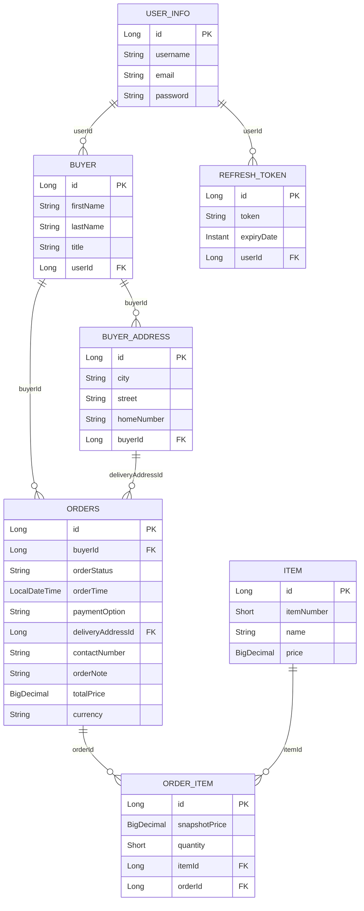

# REST API Spring Boot Application for Restaurant Management

A Spring Boot application that enables CRUD endpoints for restaurant management, includes Spring Security JWT authentication, Swagger/OpenAPI docs, JUnit and Integration tests.
Comes with H2 database and Docker Compose setup for one‐command startup.

## Tech stack

- **Java 17**
- **Spring Boot 3.4**
- **Spring Data JDBC** (relational persistence)
- **H2** (in-memory / TCP database)
- **Spring Security** + JWT (access + refresh tokens)
- **SpringDoc OpenAPI** (Swagger UI)
- **Lombok**, **Validation**
- **jUnit**, **Mockito** **Integration tests**

## Requirements

- [Java 17](https://www.oracle.com/java/technologies/downloads/#java21) (for local build)  
- [Maven](https://maven.apache.org/install.html)
- [Docker & Docker Compose](https://docs.docker.com/get-started/get-docker/)
- [Git](https://github.com/git-guides/install-git)

---

## 🚀 Quick Start with Docker Compose

1. **Clone the repo**  
   ```bash
   git clone https://github.com/MihaelMajetic141/RestaurantManager
   cd RestaurantManager
   ```

2. **Build & run**

   ```bash
   docker-compose up --build
   ```

3. **Browse the API**

    * Service: `http://localhost:8080`
    * Swagger OpenAPI:  `http://localhost:8080/swagger-ui/index.html#/`

4. **Swagger documentation tips:**

   * Use /init-data endpoint for database initialization, then register as a new user and login on /api/auth/login endpoint.
   * Copy accessToken from request body and paste it on any lock icon to save Bearer JWT token.
   * Proceed to test API endpoints.

4. **Reset & rebuild** (fresh DB)

   ```bash
   docker-compose down -v
   docker-compose up --build
   ```

---

### H2 Configuration

| Variable       | Description           | Default          |
|----------------|-----------------------|------------------|
| `DB_HOST`      | H2 server host        | `localhost`      |
| `DB_PORT`      | H2 TCP port           | `9092`           |
| `DB_NAME`      | Database name         | `restaurant_orders` |
| `DB_USERNAME`  | DB user               | `sa`             |
| `DB_PASSWORD`  | DB password           | (empty)          |
| `H2_WEB_PORT`  | H2 web console port   | `8082`           |
| `H2_TCP_PORT`  | H2 TCP port (Docker)  | `9092`           |

JWT is configured in `application.properties` (`jwt.base64-secret`). Override in production.
Current refresh token expiry is set to 7 days for API testing purposes.

## API overview

- **Auth**: register, login, refresh token.
- **Buyers**: CRUD
- **Addresses**: CRUD
- **Items**: CRUD, list with filters (name, item number, price range), pagination.
- **Orders**: CRUD with buyer, delivery address, status, payment option, order items, total price.
- **Order items**: line items (item snapshot, quantity) linked to orders.

Most endpoints are protected by JWT; authenticate via `/api/auth/login` and send `Authorization: Bearer <access_token>`.

Full API docs: **Swagger UI** at `/swagger-ui.html`.

## Database schema

The persistence model is defined under `src/main/java/hr/abysalto/hiring/api/junior/data/model/`. Below is an entity-relationship view of database tables.



### Tables (from `data/model`)

| Table           | Description |
|-----------------|-------------|
| **USER_INFO**   | Users (username, email, password) for auth. |
| **REFRESH_TOKEN** | JWT refresh tokens, linked to `USER_INFO`. |
| **BUYER**       | Buyer profile; optional link to user via `USER_ID`. |
| **BUYER_ADDRESS** | Addresses of a buyer (`BUYER_ID`). |
| **ITEM**        | Catalog items (item number, name, price). |
| **ORDERS**      | Order header: buyer, delivery address, status, payment, total, currency. |
| **ORDER_ITEM**  | Order line: quantity, snapshot price, references `ITEM` and `ORDERS`. |

### Enums (stored as strings)

- **OrderStatus**: `WAITING_FOR_CONFIRMATION`, `PREPARING`, `DONE`
- **PaymentOption**: `CASH`, `CARD_UPFRONT`, `CARD_ON_DELIVERY`

## Project layout (main parts)

```
src/main/java/hr/abysalto/hiring/api/junior/
├── Application.java
├── configuration/       # Swagger, security config
├── controller/          # REST endpoints
├── data/
│   ├── dto/request, response
│   ├── enums/          # OrderStatus, PaymentOption
│   └── model/          # Entities (see schema above)
├── exception/           # Global exception handler
├── repository/          # Spring Data JDBC repositories
├── security/            # JWT, auth, user details
├── service/             # Business logic
├── components/          # Mappers, DB init, utils
└── websocket/           # WebSocket config
```

## Tests

```bash
./mvnw test
```

Test config: `src/test/resources/application-test.properties`.
